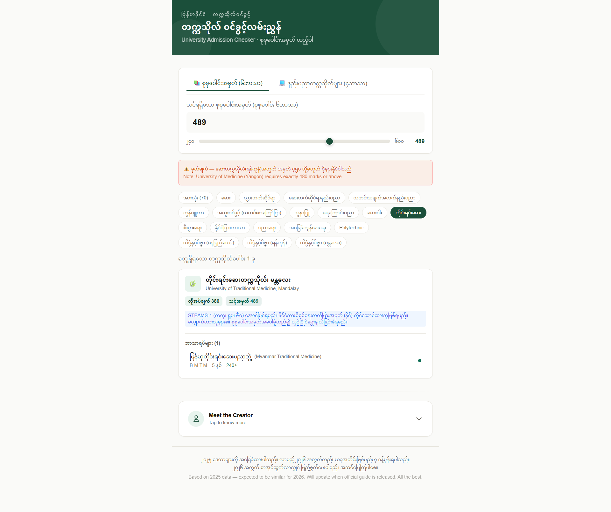

🎓 Myanmar University Admission Checker

A real-time web application that helps Myanmar Grade 12 students instantly find eligible universities and majors based on their matriculation exam marks — no more flipping through hundreds of pages of the admission guidebook.

📸 Screenshots

Desktop View
	

🚨 The Problem This Solves

Every year, hundreds of thousands of Myanmar G-12 students face the same challenge:

    The official university admission guidebook is 300+ pages long

    Students must manually calculate their marks for different subject combinations (6 subjects for medical, 4 subjects for engineering)

    Finding which universities accept their marks requires tedious page-by-page searching

    Many students miss opportunities simply because they don't know which universities they qualify for

This tool solves that problem in seconds.
✨ Features
🎯 Dual Mark Calculation
Mode	Subject Combination	For
📚 6 Subjects	Total of all 6 subjects	Medical, Dental, Arts, Science, Economics, Education
⚙️ 4 Subjects	Physics + Chemistry + Math + English	Technological Universities
🏛️ Complete University Coverage

    100+ universities across Myanmar

    15+ university categories including Medical, Technological, Computer, Economics, Arts & Science, Maritime, Aerospace, and more

    500+ majors/programs with detailed information

📊 Real-Time Filtering

    Instant results as you adjust the slider

    Filter by university type

    Expand/collapse major lists

    Visual progress bar showing how close you are to requirements

📱 Fully Responsive

    Works seamlessly on desktop, tablet, and mobile

    Touch-friendly sliders and buttons

🎯 Who This Is For
User	Benefit
G-12 Students	Find eligible universities in seconds
Parents	Help children make informed decisions
Teachers & Counselors	Guide students with accurate data
Educational Consultants	Quick reference for admission requirements
🗂️ Data Coverage
Medical & Health Sciences

    5 Medical Universities

    2 Dental Universities

    2 Pharmaceutical Universities

    2 Nursing Universities

    2 Medical Technology Universities

    1 Community Health University

    1 Traditional Medicine University

Engineering & Technology

    20+ Technological Universities (YTU, MTU, and regional TUs)

    4 Government Technical Colleges

    9 Polytechnic Universities (including Naypyitaw)

Computer & IT

    2 Major Computer Universities (UCSY, UCSM)

    15+ Regional Computer Universities

    1 Information Technology University

    MIIT (Special admission)

Arts & Sciences

    Yangon University (30+ majors)

    Mandalay University (27+ majors)

    Naypyitaw State Academy (23+ majors)

Economics & Business

    Yangon University of Economics (2 campuses)

    Monywa University of Economics

    Meiktila University of Economics

Specialized Universities

    Myanmar Maritime University

    Aerospace and Aviation University

    2 National Universities of Arts and Culture

    Cooperative Universities & Colleges

    Lacquerware College, Bagan

    Union Level Indigenous Peoples Development University

    Indigenous Youth Capacity Development Degree Colleges

Special Admission (Direct Application)

    National Management Degree College

    Yezin Agricultural University

    University of Veterinary Science, Yezin

    Agriculture and Animal Science University, Maubin

    Forest and Environmental University, Yezin

    Myanmar Institute of Information Technology (MIIT)

📋 Sample Data Entry
Your Marks	Eligible Universities Example
480+ (6 subjects)	Medical, Dental, UCSY, YUFL, Yangon University
450-479 (6 subjects)	UCSY, UCSM, Economics, Arts & Science
300-449 (6 subjects)	Computer (Regional), Economics, Arts & Science
300+ (4 subjects)	YTU, MTU, Yadanabon Cyber
240-299 (4 subjects)	Regional Technological Universities
🔧 How It Works

    Select your calculation method — 6-subjects or 4-subjects

    Enter your marks — Use slider or type directly

    View results instantly — See all eligible universities

    Filter by type — Narrow down to specific categories

    Explore majors — Expand cards to see available programs

🚀 Live Demo

View Live Demo →

https://uni-winkwint.vercel.app/

📝 Data Source

    Official Publication: 2025 University Admission Guide

    Publisher: Ministry of Education, Myanmar

    Department: Department of Higher Education

⚠️ Disclaimer

    This tool is based on the 2025 official admission guide

    2026 requirements are expected to be similar (estimated)

    Updates will be made when new official guides are released

    For final admission decisions, always refer to official sources

📄 License

MIT — Free for educational and non-commercial use.

🙏 Acknowledgments

    Ministry of Education, Myanmar for publishing the admission guide

    All G-12 students who inspired this tool

အောင်မြင်ကြပါစေ — Good luck with your university admission! 🎉
